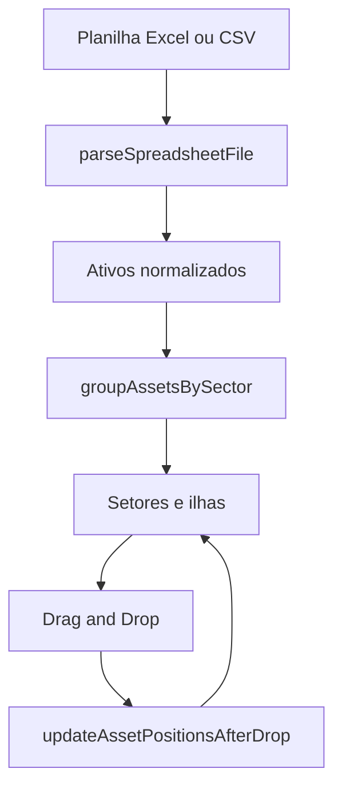

# Visualizador de Ativos por Ilha

Aplicacao web para visualizar computadores da empresa de forma mais proxima de um layout fisico, a partir de uma planilha Excel ou CSV.

O projeto foi pensado para substituir um processo manual feito no Visio, em que cada ilha precisava ser montada individualmente. Aqui, o usuario importa uma planilha com dados como `hostname`, `usuario`, `setor`, `mac` e campos relacionados, e a interface organiza automaticamente os ativos por setor em ilhas com ate 4 posicoes.

## Objetivo

O foco deste projeto e facilitar a visualizacao operacional dos ativos de TI, principalmente computadores, de um jeito simples e rapido:

- importar uma planilha existente
- agrupar os computadores por setor
- montar ilhas visuais com 4 posicoes
- localizar ativos por busca e filtro
- reorganizar a posicao dos computadores visualmente com drag and drop
- gerar uma visualizacao limpa para consulta ou impressao em PDF

## Contexto do problema

Antes, a organizacao visual das maquinas era feita manualmente no Microsoft Visio, com uma representacao de ilha e os computadores distribuidos visualmente. Esse processo funcionava, mas era demorado, repetitivo e dependia de integracoes pagas para automatizar a leitura da planilha.

Este projeto resolve esse problema com uma abordagem mais simples:

- sem backend
- sem banco de dados
- sem dependencia de integracao paga com Excel
- com leitura local do arquivo diretamente no navegador

## Como funciona

1. O usuario faz upload de um arquivo `.xlsx`, `.xls` ou `.csv`.
2. O sistema le os dados da planilha no navegador.
3. Os cabecalhos sao normalizados para aceitar variacoes de nomes, como:
   - `hostname`
   - `usuario`
   - `setor`
   - `mac`
   - `localizacao`
   - `modelo`
   - `patrimonio`
4. Os ativos sao agrupados por setor.
5. Cada setor e dividido em ilhas de 4 posicoes.
6. A interface monta automaticamente os cards visuais dos computadores.
7. O usuario pode arrastar os ativos para trocar de posicao dentro do mesmo setor.

## Funcionalidades atuais

- Upload de planilha por clique ou drag and drop
- Leitura de Excel e CSV no navegador
- Normalizacao flexivel de colunas
- Agrupamento automatico por setor
- Geração de ilhas com ate 4 computadores
- Busca global por hostname, usuario, MAC, modelo e outros campos
- Filtro por setor
- Troca visual de posicao por arrastar e soltar
- Impressao da visualizacao para PDF
- Ocultacao de campos vazios para evitar poluicao visual

## Regras visuais do projeto

- Cada ilha representa um grupo visual de 4 posicoes.
- Cada card representa um computador.
- O nome do usuario aparece em destaque no topo do card.
- O hostname aparece na area principal do equipamento.
- Campos vazios nao sao exibidos.
- O layout foi pensado para consulta rapida por equipes de TI.

## Stack utilizada

- `React 19`
- `TypeScript`
- `Vite`
- `Tailwind CSS`
- `xlsx` para leitura de planilhas
- `lucide-react` para icones
- `framer-motion` para animacoes
- `@dnd-kit/core`, `@dnd-kit/sortable` e `@dnd-kit/utilities` para drag and drop

## Estrutura principal

Arquivos mais importantes do projeto:

- `src/App.tsx`: composicao principal da tela, filtros, resumo, upload e contexto de drag and drop
- `src/helpers/parse-spreadsheet-file.ts`: leitura e normalizacao da planilha
- `src/helpers/group-assets-by-sector.ts`: agrupamento por setor e montagem das ilhas
- `src/helpers/update-asset-positions-after-drop.ts`: troca de posicoes apos arrastar e soltar
- `src/components/asset-node.tsx`: card visual de cada computador
- `src/components/island-card.tsx`: renderizacao visual da ilha
- `src/components/sector-section.tsx`: agrupamento visual por setor

## Fluxo de dados



## Limitacoes atuais

- A troca de posicao funciona apenas dentro do mesmo setor.
- Os dados nao sao persistidos apos atualizar a pagina.
- O projeto depende de a planilha conter cabecalhos minimamente reconheciveis.
- Ainda nao existe exportacao estruturada da nova organizacao para um novo arquivo.

## Possiveis proximos passos

- persistir a organizacao no `localStorage`
- permitir mover ativos entre setores
- exportar a nova distribuicao para Excel ou JSON
- adicionar visualizacao por sala, andar ou unidade
- criar modo de mapa fisico mais proximo da planta real

## Como rodar o projeto

1. Abra um terminal na pasta do projeto:

```powershell
cd c:\IT
```

2. Instale as dependencias:

```powershell
npm install
```

3. Inicie o ambiente de desenvolvimento:

```powershell
npm run dev
```

4. Abra no navegador a URL exibida pelo Vite, normalmente:

```text
http://localhost:5173
```

## Comandos uteis

```powershell
npm run dev
npm run build
npm run preview
npm run lint
```
# React + TypeScript + Vite

This template provides a minimal setup to get React working in Vite with HMR and some ESLint rules.

Currently, two official plugins are available:

- [@vitejs/plugin-react](https://github.com/vitejs/vite-plugin-react/blob/main/packages/plugin-react) uses [Oxc](https://oxc.rs)
- [@vitejs/plugin-react-swc](https://github.com/vitejs/vite-plugin-react/blob/main/packages/plugin-react-swc) uses [SWC](https://swc.rs/)

## React Compiler

The React Compiler is not enabled on this template because of its impact on dev & build performances. To add it, see [this documentation](https://react.dev/learn/react-compiler/installation).

## Expanding the ESLint configuration

If you are developing a production application, we recommend updating the configuration to enable type-aware lint rules:

```js
export default defineConfig([
  globalIgnores(['dist']),
  {
    files: ['**/*.{ts,tsx}'],
    extends: [
      // Other configs...

      // Remove tseslint.configs.recommended and replace with this
      tseslint.configs.recommendedTypeChecked,
      // Alternatively, use this for stricter rules
      tseslint.configs.strictTypeChecked,
      // Optionally, add this for stylistic rules
      tseslint.configs.stylisticTypeChecked,

      // Other configs...
    ],
    languageOptions: {
      parserOptions: {
        project: ['./tsconfig.node.json', './tsconfig.app.json'],
        tsconfigRootDir: import.meta.dirname,
      },
      // other options...
    },
  },
])
```

You can also install [eslint-plugin-react-x](https://github.com/Rel1cx/eslint-react/tree/main/packages/plugins/eslint-plugin-react-x) and [eslint-plugin-react-dom](https://github.com/Rel1cx/eslint-react/tree/main/packages/plugins/eslint-plugin-react-dom) for React-specific lint rules:

```js
// eslint.config.js
import reactX from 'eslint-plugin-react-x'
import reactDom from 'eslint-plugin-react-dom'

export default defineConfig([
  globalIgnores(['dist']),
  {
    files: ['**/*.{ts,tsx}'],
    extends: [
      // Other configs...
      // Enable lint rules for React
      reactX.configs['recommended-typescript'],
      // Enable lint rules for React DOM
      reactDom.configs.recommended,
    ],
    languageOptions: {
      parserOptions: {
        project: ['./tsconfig.node.json', './tsconfig.app.json'],
        tsconfigRootDir: import.meta.dirname,
      },
      // other options...
    },
  },
])
```
