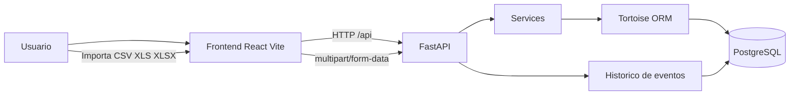

# IT Inventory Visualizer

Aplicacao full stack para importar planilhas de inventario, persistir ativos em PostgreSQL e visualizar a distribuicao de maquinas por setor e ilha.

O projeto foi organizado como monorepo, com frontend em React/Vite e backend em FastAPI. A aplicacao permite:

- importar planilhas `CSV`, `XLS` e `XLSX`
- criar, editar, mover e excluir maquinas
- visualizar historico de movimentacao e edicao
- criar ilhas com capacidade personalizada
- excluir ilhas vazias
- exportar o inventario consolidado em CSV

## Visao Geral

### Stack principal

- Frontend: React 19, TypeScript, Vite, Tailwind CSS, TanStack Query, Axios, DnD Kit, Framer Motion
- Backend: FastAPI, Tortoise ORM, PostgreSQL, Uvicorn
- Importacao: `openpyxl`, `xlrd`, `python-multipart`
- Infra local: Docker Compose

### Estrutura do repositorio

- `frontend/`: interface web
- `backend/`: API, models, services e schemas
- `docker-compose.yml`: banco PostgreSQL e backend
- `.env.example`: variaveis de ambiente de referencia
- `public/assets-exemplo.csv`: planilha de exemplo para testes

## Arquitetura



## Fluxo da aplicacao

1. O usuario importa uma planilha pela interface.
2. O frontend envia o arquivo para `POST /api/inventory/bulk-import`.
3. O backend processa as colunas, normaliza os dados e cria ou atualiza ativos.
4. Os ativos sao distribuidos nas ilhas do setor, respeitando a capacidade configurada de cada ilha.
5. O frontend consulta setores, ilhas e ativos e renderiza a topologia visual.
6. Movimentacoes, edicoes, criacoes e importacoes ficam registradas no historico.

## Requisitos

Para rodar sem Docker:

- Node.js 20+
- npm 10+
- Python 3.12+
- PostgreSQL 16+

Para rodar com Docker:

- Docker
- Docker Compose

## Variaveis de ambiente

Crie o arquivo `.env` na raiz usando o `.env.example`:

```bash
cp .env.example .env
```

Valores padrao atuais:

```env
PROJECT_NAME=IT Backend
APP_ENV=development
BACKEND_HOST=0.0.0.0
BACKEND_PORT=8000
POSTGRES_DB=it_db
POSTGRES_USER=postgres
POSTGRES_PASSWORD=postgres
POSTGRES_HOST=db
POSTGRES_PORT=5432
```

## Como rodar com Docker

Essa e a forma mais direta para subir banco e backend.

```bash
cp .env.example .env
docker compose up --build
```

Servicos esperados:

- Backend: `http://localhost:8000`
- Healthcheck: `http://localhost:8000/health`
- PostgreSQL: `localhost:${POSTGRES_PORT}`

Depois disso, rode o frontend separadamente:

```bash
cd frontend
npm install
npm run dev
```

Frontend esperado:

- `http://localhost:5173`

O `Vite` ja possui proxy para `http://localhost:8000` nas rotas `/api` e `/health`.

## Como rodar sem Docker

### 1. Backend

```bash
cd backend
python3 -m venv .venv
source .venv/bin/activate
pip install -r requirements.txt
uvicorn app.main:app --reload --host 0.0.0.0 --port 8000
```

### 2. Frontend

```bash
cd frontend
npm install
npm run dev
```

### 3. Banco

Garanta que o PostgreSQL esteja rodando e que as variaveis do `.env` apontem para ele.

## Scripts uteis

### Frontend

```bash
cd frontend
npm run dev
npm run build
npm run lint
```

### Backend

```bash
cd backend
python3 -m compileall app
```

## Rotas principais da API

### Health

- `GET /health`

### Importacao

- `POST /api/inventory/bulk-import`

### Ativos

- `GET /api/assets`
- `GET /api/assets/{id}`
- `POST /api/assets`
- `PUT /api/assets/{id}`
- `PATCH /api/assets/{id}`
- `PATCH /api/assets/{id}/move`
- `DELETE /api/assets/{id}`
- `GET /api/assets/{id}/history`

Filtros relevantes:

- `GET /api/assets?sector=Financeiro`
- `GET /api/assets?search=DSK-123`

### Setores e ilhas

- `GET /api/sectors`
- `GET /api/sectors/{sector_name}/islands`
- `POST /api/sectors/{sector_name}/islands`
- `DELETE /api/sectors/islands/{island_id}`

### Exportacao

- `GET /api/export`

## Exemplos de uso da API

### Criar uma maquina

```bash
curl -X POST http://localhost:8000/api/assets \
  -H "Content-Type: application/json" \
  -d '{
    "name": "DSK-900",
    "sector_name": "Financeiro",
    "desktop_name": "FIN-900",
    "user_name": "Maria"
  }'
```

### Criar uma ilha com 2 slots

```bash
curl -X POST http://localhost:8000/api/sectors/Financeiro/islands \
  -H "Content-Type: application/json" \
  -d '{
    "capacity": 2
  }'
```

### Excluir uma ilha vazia

```bash
curl -X DELETE http://localhost:8000/api/sectors/islands/12
```

### Exportar inventario

```bash
curl -L http://localhost:8000/api/export -o inventory-export.csv
```

## Comportamentos importantes

### Ilhas

- A capacidade padrao de novas ilhas automaticas e `4`
- O limite maximo para criacao manual e `8`
- Ilhas vazias podem ser excluidas manualmente
- A exclusao reordena a sequencia das ilhas do setor
- O backend respeita capacidades diferentes dentro do mesmo setor

### Historico

Eventos que ficam registrados:

- criacao
- importacao
- atualizacao
- movimentacao

O frontend traduz esses eventos em linguagem natural no modal de historico.

## Como validar o ambiente

### Validar backend

```bash
curl http://localhost:8000/health
```

Resposta esperada:

```json
{
  "status": "ok",
  "environment": "development"
}
```

### Validar frontend

1. Abrir `http://localhost:5173`
2. Importar `assets-exemplo.csv`
3. Criar uma nova maquina
4. Criar uma ilha personalizada
5. Arrastar uma maquina para outro slot
6. Abrir o historico da maquina
7. Exportar o CSV

## Como visualizar as tabelas no banco

Se estiver usando Docker:

```bash
docker exec -it it-db-1 psql -U postgres -d it_db
```

Dentro do `psql`:

```sql
\dt
\d assets
\d islands
\d sectors
\d asset_history
select * from sectors;
select * from islands order by sector_id, sequence_number;
select * from assets order by sector_id, island_id, slot_index;
```

## Observacoes

- O backend cria schemas automaticamente no startup via Tortoise ORM.
- O frontend depende do backend rodando em `localhost:8000` durante o desenvolvimento.
- O processamento da planilha acontece exclusivamente no backend.
